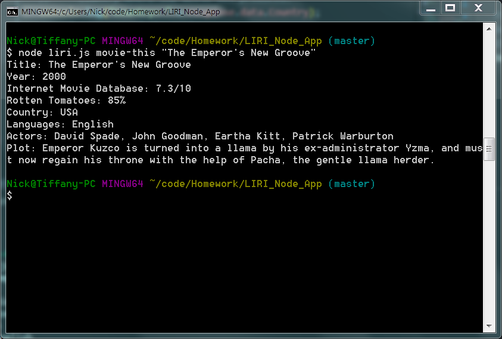
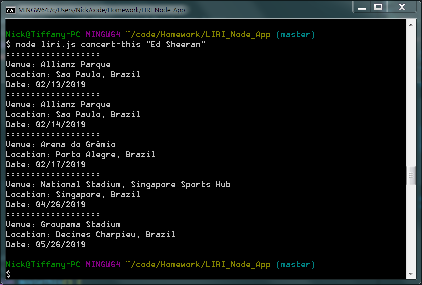
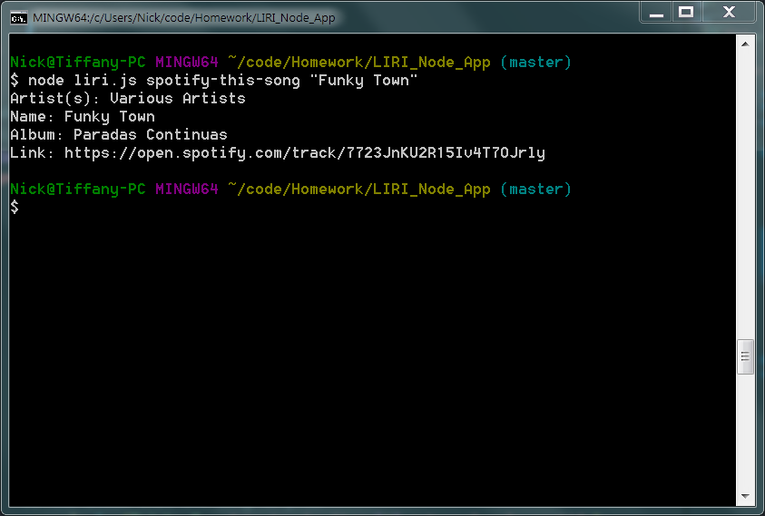

# LIRI_Node_App

## What is LIRI?
LIRI is a Language Interpretation and Recognition Interface. LIRI will be a command line node app that takes in parameters and gives you back data. LIRI will search Spotify for songs, Bands in Town for concerts, and OMDB for movies.

## Required NPMs:
* axios
* node-spotify-api
* fs
* moment
* dotenv

## How to use LIRI:
First and foremost, in order to correctly use LIRI please be sure to install the above NMPs and obtain the required keys for the Spotify API (https://developer.spotify.com/dashboard/login).

The next step is to open the path to the LIRI app through the terminal. The command line should read like so:

```
node liri.js action "search"
```

The **action** can be one of the below options. 
```
movie-this
concert-this
spotify-this-song
do-what-it-says
```
**search** will be the topic (song, movie, band, etc). Placing quotations around the search will narrow down results.

Once the command has been submitted, the information will be logged onto the console. The next sections will include images of succesfully using the LIRI app.

### Search Movie:
Searching for a movie will result in listing the movie's release year, plot, ratings, and other infomration about the movie specified. The command for this example will be:
```
node liri.js movie-this "The Emperor's New Groove"
```


If the user does not supply a search LIRI will give the result for "Mr. Nobody" by default.

### Search Concert:
Searching for a band or artist will list the next 5 upcoming events for that artist. It will give the venue name, where it is located, and what day. The command for this example will be:
```
node liri.js concert-this "Ed Sheeran"
```


### Search Song
Searching for the song will list the artist, name of the song, the album, and a link to spotify to preview the song. The command for this example will be:
```
node liri.js spotify-this-song "Funky Town"
```


If the user does no supply a search LIRI will give the result for "The Sign" by The Ace of Base by default.

### Do Whatever You Want Liri!
LIRI has a special command to read from the random.txt file and run whatever the text says by using the command:
```
node liri.js do-what-it-says
```
